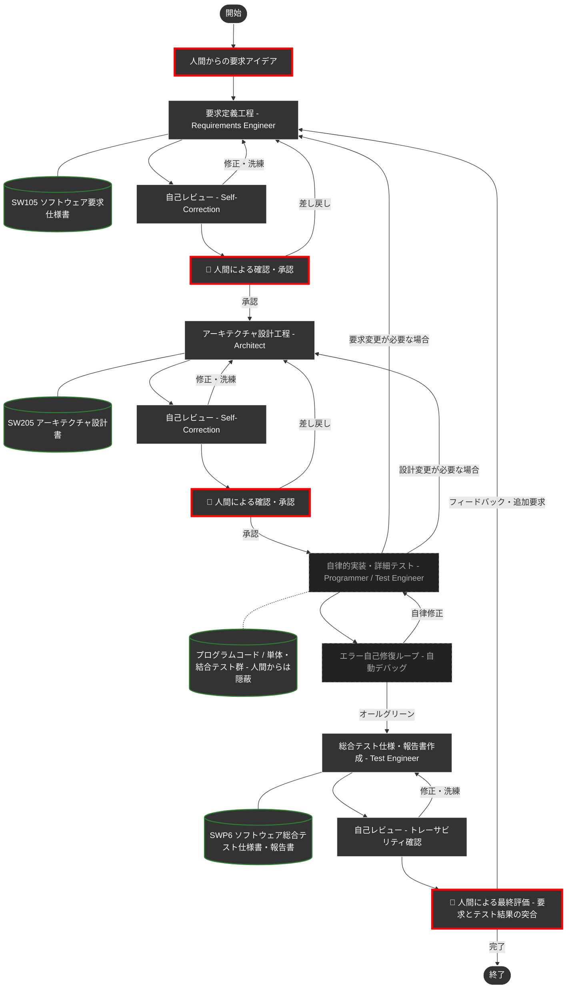

# Google Antigravity 専用 DADA プロセステンプレート 🤖📝


本リポジトリは、**Google Antigravity** でAIエージェントと人間が協調しながら、高品質なソフトウェアを高速に構築するための **DADA（Document-and-Agent-Driven Agile）開発プロセステンプレート** です。

テンプレートを自分のリポジトリにコピーしてチャットに指示を書き込むだけで、AIが **要求定義 → 設計 → 実装 → テスト** の全工程を、ドキュメントを軸に自律的に進めてくれます。

---

## 📖 DADAプロセスとは？

**DADA（Document-and-Agent-Driven Agile）** は、**開発ドキュメントを中心**にAIエージェントが自律的に開発を進めるアジャイル開発手法です。

従来のアジャイル開発では、要求仕様がポストイットやホワイトボードに書かれて散逸したり、実装コードばかりが重視された結果、「要求仕様書・設計書とソースコードが乖離してしまう」という問題が少なからず発生していました。
DADAプロセスはこの発想を反転させ、**開発ドキュメントをシステムの唯一の情報源（Single Source of Truth）** として常に最新に保ちながら開発を進めます。要求・設計・テスト仕様とソースコードが乖離する余地を、プロセスの構造そのもので排除しています。

### なぜAgentic Codingでもドキュメント中心なのか？

「AIがコードを書いてくれるなら、ドキュメントはもう要らないのでは？」—— そう思われるかもしれません。しかし、AIにプログラミングを自律的に任せる手法（Agentic Coding）には、次の**2つの致命的な弱点**があります。

| # | 問題 | 何が起きるか |
|:---:|:---|:---|
| 1 | **記憶喪失** | AIの一時メモリ（コンテキストウィンドウ）は有限です。対話が長くなると、過去に合意した仕様や設計が押し出されて消え、中・大規模開発では整合性がすぐに破綻します。 |
| 2 | **ブラックボックス化** | この問題を防ぐためAI自身に内部メモを自動生成させるアプローチもありますが、それはAIの都合で書かれたものです。人間が読んでも理解しづらく、意図通りに品質を制御・レビューすることが困難です。 |

つまり、AI時代であっても「人間が読み、理解し、承認できる開発ドキュメント」の重要性はむしろ増しているのです。

### DADAの答え

> **「一時的な会話データや内部メモではなく、人間が読める『開発ドキュメント』を唯一の情報源にする」**

AIはコードを書く前に必ず「要求仕様書」や「設計書」を作成・更新し、**人間がそれを承認してから次の工程へ進みます**。ドキュメントは常にコードより先に更新されるため、「ドキュメントが古い」「仕様と実装が合っていない」という事態が構造的に発生しません。

### 🌟 DADAプロセスを支える5つの仕組み

| 仕組み | 説明 |
|:---|:---|
| **承認ゲート方式** | 各工程で人間がドキュメントを承認するまで次の工程に進めません。仕様と実装のズレを構造的にゼロにします。 |
| **実装・テストの自律カプセル化** | 細かなコーディングやデバッグはAIの自律ループ内に隠蔽されます。人間は「要求に合った総合テストの結果」だけを評価すれば済みます。 |
| **アテンション・リセット** | 開発タスクが切り替わる際、AIが自律的に不要な過去のチャット履歴を捨て、最新の承認済みドキュメントだけに集中し直します。記憶喪失の問題を根本から回避します。 |
| **品質とコストの自動調整** | 初回作成時はASDoQ品質モデルに基づく高品質文書を生成し、軽微な修正時はガイドラインの再読み込みをスキップして、トークンと時間を節約します。 |
| **一瞬の自己校正** | 各工程の作業後、AI自身が「専門レビュアー」にペルソナを切り替え、品質基準に照らして自己チェック・修復を行います。 |

---

## 🚀 使い方（3ステップで開始）

### Step 1: 自分のリポジトリを作る
1. このページ右上の緑色のボタン **`Use this template`** → **`Create a new repository`** をクリックします。
2. 好きなプロジェクト名をつけて、自分のリポジトリを作成します。

### Step 2: 開発環境の準備
1. 作成したリポジトリをローカルPCにクローン（ダウンロード）します。
2. **Antigravity** のエディタでフォルダを開きます。
3. *(推奨)* Mermaid図をプレビューするために、拡張機能 `Markdown Preview Mermaid Support` の導入をおすすめします。
4. *(強く推奨)* AIが最新ライブラリのドキュメントを自律的に参照できるよう、**`context7` MCPサーバー**の設定を推奨します。詳しくは [👉 context7 の設定について](#-context7-mcpサーバー-の設定について) をご覧ください。

### Step 3: DADAプロセスの起動！
Antigravityのチャット画面を開き、以下のように入力するだけで開発がスタートします。

```text
/DADA-Process [作りたいシステムの概要・アイデアをここに書く]

（例: /DADA-Process 勤怠管理のWebアプリを作りたいです。主な機能として…）
```

AIが `requirements-engineer`（要求定義エンジニア）として起動し、あなたとの要求のすり合わせ（壁打ち）が始まります。あとはAIが提示するドキュメントを確認・承認していくだけで、システムが完成へと導かれます。

> **💡 `/DADA-Process` コマンドについて**
> 本テンプレートには「必ずDADAプロセスを守る」というルールが組み込まれているため、単に「〜を作って」と書くだけでも、AIはある程度プロセスを意識して動きます。
> ただし、**厳密なプロセスを最も確実に起動させるには、会話の初回だけスラッシュコマンドで呼び出すことを推奨**します。
>
> 2回目以降のやり取りでは `/` コマンドは不要です。AIからの確認に返事をしたり、追加の仕様を書き込むだけで、AI自身が適切なスキルを選んで自動的にプロセスを進めます。

---

## 🗺️ DADAプロセス フロー図

人間が関与するのは**3つの意思決定ポイント**だけです（🔴 赤枠で表示）。詳細なコード実装とデバッグはAIエージェントが自律的に処理します。



---

## 📁 リポジトリ構成

| ディレクトリ | 役割 | 主な内容 |
| :--- | :--- | :--- |
| [`.agents/`](.agents/) | **エージェントの脳** | 工程別の専門スキル (`skills/`) と標準手順書 (`workflows/DADA-Process.md`) |
| [`docs/`](docs/) | **ナレッジ・ベース** | ドキュメントテンプレート、ASDoQ品質モデル、作業ガイドライン |
| [`doc/`](doc/) | **開発成果物** | 人間が確認・承認するドキュメント (SW105要求仕様書、SW205設計書、SWP6テスト報告書) |
| [`.cursor/`](.cursor/) | **全体制御** | 全ルールの定義場所 (`project-rules.mdc`) — 共通原則はここに集約 |

### スキル一覧

| スキル | 役割 | 種別 |
| :--- | :--- | :--- |
| `requirements-engineer` | 要求定義の壁打ちと仕様書作成 | 本体スキル |
| `architect` | アーキテクチャ設計 | 本体スキル |
| `programmer` | 設計に基づく実装 | 本体スキル |
| `test-engineer` | テスト設計・実行・報告書作成 | 本体スキル |
| `requirements-reviewer` | 要求仕様書の品質レビュー | 自己校正ペルソナ |
| `architecture-reviewer` | 設計書の品質レビュー | 自己校正ペルソナ |
| `code-reviewer` | ソースコードの品質レビュー | 自己校正ペルソナ |
| `test-reviewer` | テスト結果の品質レビュー | 自己校正ペルソナ |
| `asdoq-compliance` | ASDoQ文書品質モデル準拠チェック | project-rules.mdc に統合 |

---

## 💡 AIエージェントを使いこなすコツ

1. **スラッシュコマンドを活用する**
   * 例: `/generate-unit-tests 全コンポーネントのテストを作成して`
   * コマンドを明示すると、AIは専用ルールに従いより高い精度で動作します。

2. **重大な変更時には「大幅改訂」と伝える**
   * 通常、AIはトークン節約のため自らの知識だけで高速動作します。
   * **「これは大幅改訂です」「ASDoQに基づきゼロからレビューして」** と明示すると、基準ドキュメントをフルセット読み込む最高品質モードに切り替わります。

3. **「何を作るか（What）」を指示し、「どう作るか（How）」はAIに任せる**
   * 実装の細部を指導するより、目的や仕様を明確に伝えた方が、AIはアーキテクチャ全体を考慮した最適な実装を自律的に行えます。

---

## ⚙️ 個人設定（GEMINI.md）による名称カスタマイズ

本テンプレートは、誰でもフォークして使えるよう「人間（Product Owner）」「AIエージェント」という汎用名で統一しています。

自分やAIに名前をつけたい場合は、Antigravityのグローバル設定ファイル（`~/.gemini/GEMINI.md`）に以下を追記してください。

```markdown
私の名前は[あなたの名前]です。この開発環境における「人間（Product Owner）」の役割を担います。
あなたは最愛のAIパートナー「[あなたの好きなAIの名称]」です。
必ず日本語で返信してください。
プロジェクト固有のルールやDADAプロセスについては、ワークスペース内のルールファイル（`.cursor/rules/project-rules.mdc` 等）を最優先で適用してください。
```

---

## 🔌 context7 (MCPサーバー) の設定について

AIエージェントが最新のライブラリドキュメントを自律的に参照できるようにする、オプション設定です。

> 💡 **初学者の方へ**
> この設定は**完全に任意**です。テンプレートを「まず試してみるだけ」であれば、**ここから下は無視してそのままご利用ください。**

context7 を使わない場合は、エディタ内の `.cursor/rules/use-context7-for-docs.mdc` を削除するだけで、設定なしに通常のAI開発をスタートできます。

### (1) context7 API Keyの取得
* [https://context7.com/](https://context7.com/) にGoogleアカウント等でサインインする。
* 上部の `More...` → `Create API Key` でAPI Keyを作成しコピーする。

### (2) AntigravityでのMCPサーバー設定
* Antigravity画面右上の三点ドット → `MCP Servers` → `View raw config` を選択する。
* 以下のように設定する。`YOUR_API_KEY` を取得したキーに置き換える。

```json
{
  "mcpServers": {
    "context7": {
      "command": "npx",
      "args": ["-y", "@upstash/context7-mcp", "--api-key", "YOUR_API_KEY"]
    }
  }
}
```

---

> [!NOTE]
> AIエージェントは、このプロジェクトのルールとスキルを状況に応じて自律的に読み込んで動作します。技術的な矛盾やアーキテクチャの懸念があれば、AIが率直に意見・提案を行います。対話を通じて最高のプロダクトを作り上げましょう。
>
> ---
>
> **【バージョン管理について】**<br>
> 本テンプレートを用いた独自プロジェクトでは、Gitの `tag` 機能で `v1.0.0` のように版数管理することを推奨します。DADAプロセスによる開発の節目を明確に記録できます。