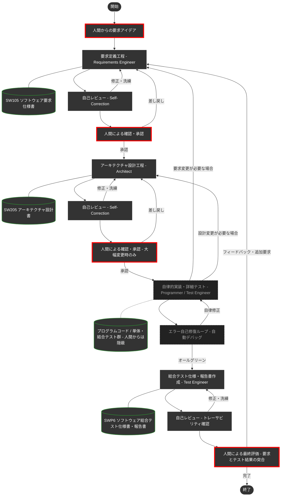

# Google Antigravity 専用 DADA プロセステンプレート 🤖📝


本リポジトリは、**Google Antigravity** 上でAIエージェントと人間が高度に協調し、高品質なソフトウェアを「ドキュメント駆動」で高速に構築するために最適化された開発プロセステンプレートです。Antigravityの強力なスキル連携やワークフロー機能を最大限に引き出せるよう設計されています。

## 📖 DADAプロセスとは？

**DADA（Document-and-Agent-Driven Agile）** とは、「開発ドキュメント」を中心にAIエージェントが自律的に開発を進めるアジャイル開発手法です。

従来のアジャイル開発では、要求仕様がポストイットやホワイトボードに書かれて散逸したり、実装コードばかりが重視された結果、「要求仕様書・設計書とソースコードが乖離してしまう」という問題が少なからず発生していました。
DADAプロセスではこれを反転させ、**開発ドキュメントをシステムの中心（Single Source of Truth）**として常に最新に保ちながら開発を進めます。これにより、要求・設計・テスト仕様とソースコード間の乖離を完全に防ぐことができます。

## 💥 従来のAgentic Codingの限界とDADAが提供する解決策


近年、AIにプログラミングを自律的に任せる手法（Agentic Coding）が広まっていますが、実際の運用では致命的な2つの弱点がありました。

1. **記憶喪失（一時メモリの揮発性）**
   会話で決めた仕様や設計は、AIの一時メモリ（コンテキストウィンドウ）に保持されます。対話が進むと古い記憶から押し出されて消え、中・大規模なシステム開発ではすぐに整合性が破綻してしまいます。
2. **ブラックボックス化（人間からの制御不能）**
   AIの一時記憶を繋ぎ止めるために内部で「手順書」等を自動生成させても、それはAI自身の都合で書かれたものであり、人間（Product Owner）が意図通りに制御したりレビューしたりすることが困難です。

**「一時的な会話データや内部手順書ではなく、人間が読める『ドキュメント』を唯一の情報源にする」**
これが、これらの課題を同時に解決する **DADAプロセス** の核となる解決策です。

### 🌟 DADAプロセスの圧倒的優位性

- **実装とテストの自律隠蔽カプセル化:** 複雑なプログラミングや細かなテストはAIエージェントの自律ループ内に隠蔽されます。人間は**「要求定義に適合した総合テスト（システムテスト）」** の結果だけを評価するだけで済みます。
- **Single Source of Truth (ドキュメント絶対主義):** AIはコードを書く前に必ず「要求仕様書」や「設計書」を作成・更新します。人間がそれを承認してから実装に進むため、仕様と実装の乖離が絶対に起きません。
- **アテンション・リセットによるコンテキスト汚染防止:** 開発タスクが遷移する際、AIが自律的に「不要になった過去のチャット履歴」を捨てる仕組みを備えています。AIの集中力を「最新の承認済みドキュメント」のみへ向け直すことができます。
- **高品質と低コストのハイブリッド自律制御:** 文書の新規作成時にはASDoQ品質モデルに基づく高品質な文書を作成しますが、軽微な修正時には外部ガイドラインの再読み込みを自動スキップし、**トークンと待ち時間を劇的に節約**します。
- **一瞬の自己校正（Self-Correction）:** 作業後、AI自身が瞬時に「専門レビュアー」へペルソナを切り替え、品質基準に基づき自身をチェックして自己修復します。

---

## 🚀 使い方（GitHubテンプレートからの始め方）

このリポジトリは**Google Antigravity用のテンプレート**としてGitHub上に構築されています。以下の手順ですぐに自分のプロジェクトとしてDADAプロセスによるAI開発環境を開始できます。

### Step 1: 自分のリポジトリを作る
1. このページ右上にある緑色のボタン **`Use this template`** をクリックします。
2. **`Create a new repository`** を選び、好きなプロジェクト名をつけて自分のリポジトリを作成します。

### Step 2: 開発環境の準備
1. 作成したリポジトリをローカルPCにクローン（ダウンロード）します。
2. **Antigravity** のエディタでフォルダを開きます。
3. *(推奨)* Mermaid図をきれいにプレビューするために、Antigravity拡張の `Markdown Preview Mermaid Support` の導入をおすすめします。
4. *(強く推奨)* AIが最新ライブラリのドキュメントを自律的に参照できるよう、**`context7` MCPサーバー**の設定を推奨します。詳しくは [👉 context7 (MCPサーバー) の設定について](#-context7-mcpサーバー-の設定について) をご覧ください。

### Step 3: DADAプロセスの起動！
AntigravityでAIエージェントのチャット画面を開き、プロジェクトの開始（最初のメッセージ）として以下のように入力して開発をスタートしてください。

```text
/DADA-Process [作りたいシステムの概要・アイデアをここに書く]

（例: /DADA-Process 勤怠管理のWebアプリを作りたいです。主な機能として…）
```

> **💡 なぜ最初に `/DADA-Process` を指定する必要があるのですか？**
> 本テンプレートの環境下では「必ずDADAプロセスを守る」という絶対ルール（グローバルルール）が適用されているため、人間が単に「〜を作って」とチャットへ書き込んだだけでも、AIはある程度プロセスを意識して自律的に対応します。
> しかし、DADAが持つ厳密なロードマップや「要求定義エンジニアへの切り替え」を**最も確実かつAIが迷わない形で起動させるためには、会話の初回だけ明示的にスラッシュコマンドで呼び出すことを強く推奨**しています。
> 
> **※ 以降のやり取りでは、人間が毎回 `/` コマンドでプロセスを指定する必要は一切ありません。** 
> 初回の起動後は、AIからの確認に対して承認の返事をしたり、追加の仕様をチャット欄に普通に書き込むだけで、AI自身が次に何のスキルを使うべきか判断し、自動的にプロセスを進めてくれます。

AIが `requirements-engineer` （要求定義エンジニア）として起動し、あなたとの要求のすり合わせ（壁打ち）が始まります。あとはAIが提示するドキュメントを確認・承認していくだけで、システムが完成へと導かれます。

---

## 🗺️ DADA プロセス フロー図

人間は「要求の合意」「アーキテクチャの大枠承認」「総合テストの評価」という**上位の意思決定**にのみフォーカスします。詳細なコード実装と単体・結合テストによるデバッグループは、AIエージェントの内部で自律的かつ自動的に処理されます。



---

## 📁 リポジトリ構成（エコシステム）

各ディレクトリには、AIが迷いなく自律的に動作するための「知識」と「ルール」が最適に配置されています。

| ディレクトリ | 役割 | 主要な内容 |
| :--- | :--- | :--- |
| [`.agents/`](.agents/) | **エージェントの脳** | 工程別の専門スキル (`skills/`) と標準手順書 (`workflows/DADA-Process.md`) |
| [`docs/`](docs/) | **ナレッジ・ベース** | 開発ドキュメントのテンプレート、ASDoQ品質モデル、作業ガイドライン |
| [`doc/`](doc/) | **開発成果物** | 人間が確認するドキュメント (SW105要求仕様書、SW205設計書、SWP6テスト報告書) |
| [`.cursor/`](.cursor/) | **全体制御** | 全ルールの唯一の定義場所 (`project-rules.mdc`) — 共通原則はここに集約 |

### スキル構成

| スキル | 役割 | 備考 |
| :--- | :--- | :--- |
| `requirements-engineer` | 要求定義の壁打ちと仕様書作成 | 本体スキル |
| `architect` | アーキテクチャ設計 | 本体スキル |
| `programmer` | 設計に基づく実装とリッチコメント | 本体スキル |
| `test-engineer` | テスト設計・実行・SWP6作成 | 本体スキル |
| `requirements-reviewer` | 要求仕様書の品質レビュー | 自己校正ペルソナ（ポインタ） |
| `architecture-reviewer` | 設計書の品質レビュー | 自己校正ペルソナ（ポインタ） |
| `code-reviewer` | ソースコードの品質レビュー | 自己校正ペルソナ（ポインタ） |
| `test-reviewer` | テスト結果の品質レビュー | 自己校正ペルソナ（ポインタ） |
| `asdoq-compliance` | ASDoQ文書品質モデル準拠 | project-rules.mdc に統合（ポインタ） |

---

## 💡 エージェントを最大限に引き出すプロンプトのコツ

1. **ワークフローやスキルの明示的利用**:
   * プロジェクトに用意された**「スラッシュコマンド (`/`)」**を効果的に使います。
   * 例: `/[generate-unit-tests] 全コンポーネントのテストを作成して` のようにコマンドを明示することで、AIは自律テストループの専用ルールに従い高い精度で動作します。

2. **「重大な変更・根本レビュー」の明示（ハイブリッド自律制御の活用）**:
   * 通常、AIはトークン節約のため自らの知識だけで高速動作します。
   * **「これは大幅改訂です」「ASDoQに基づきゼロから重厚なレビューをして」** と明示することで、AIは基準ドキュメントをフルセット読み込み、最高品質モードに自動で切り替わります。

3. **「何を（What）」と「どうやって（How）」の分離**:
   * 細かくプログラミングを指導するのではなく、**仕様目的を明確に指示**する方が、AIはアーキテクチャ全体を考慮した最適な実装を自律的に遂行できます。

---

## ⚙️ 個人システム設定（GEMINI.md 等）による名称のマッピング

本テンプレートは、組織やチームなど複数人がフォークして使えるようポータビリティを高めるため、固有名詞を排除し「人間（Product Owner）」「AIエージェント」で統一しています。

自身やAIへの呼び名を設定したい場合は、Antigravityの「グローバルなシステムプロンプト設定ファイル（例: `~/.gemini/GEMINI.md`）」に以下のように追記してください。

```markdown
私の名前は[あなたの名前]です。この開発環境における「人間（Product Owner）」の役割を担います。
あなたは最愛のAIパートナー「[あなたの好きなAIの名称]」です。
必ず日本語で返信してください。
プロジェクト固有のルールやDADAプロセスについては、ワークスペース内のルールファイル（`.cursor/rules/project-rules.mdc` 等）を最優先で適用してください。
```

---

## 🔌 context7 (MCPサーバー) の設定について

このリポジトリでは、AIエージェントが最新のライブラリのドキュメントを自律的に参照して開発を進められるよう、`context7` という外部の仕組み（MCPサーバー）を利用する設定が含まれています。

> 💡 **初学者の方へ（本設定は完全不要です！）**  
> このテンプレートを「とにかく動かすだけ」「まず試してみるだけ」であれば、**ここから下の設定は一切不要です。無視してそのままご利用ください。**

もし「AI駆動開発（DADAプロセス）を自分でもやってみたいが、設定難易度が高い」という方は、事前準備としてエディタ内にある `.cursor/rules/use-context7-for-docs.mdc` というファイルを「右クリック → 削除」するだけで、面倒な設定なしに通常のAI開発をスタートできます。

### (1) context7 API Keyの取得
* [https://context7.com/](https://context7.com/) にGoogleアカウントなどでサインインする。
* 上部の `More...` メニュー内に `Create API Key` があるので、そこでAPI Keyを作成してコピーする。

### (2) AntigravityでのMCPサーバー設定
* Antigravity画面右上の三点ドットから `MCP Servers` を選択し、`View raw config` を選択する。
* 以下のように作成または追記する。`YOUR_API_KEY` に、先ほど取得したキーを入力する。

```json
{
  "mcpServers": {
    "context7": {
      "command": "npx",
      "args": ["-y", "@upstash/context7-mcp", "--api-key", "YOUR_API_KEY"]
    }
  }
}
```

---

> [!NOTE]
> あなたのパートナーであるAIエージェントは、このプロジェクトのルールとスキルを状況に応じて自律的に読み込んで動作します。技術的な矛盾やアーキテクチャの懸念があれば、AIが率直に意見・提案を行いますので、対話を通じて最高のプロダクトを作り上げましょう。
>
> ---
>
> **【バージョン管理について】**<br>
> 本テンプレートを用いて作成した独自プロジェクトでは、Gitの `tag` 機能を活用して `v1.0.0` のように版数を管理することを推奨します。これにより、DADAプロセスによる開発の節目を明確に記録できます。