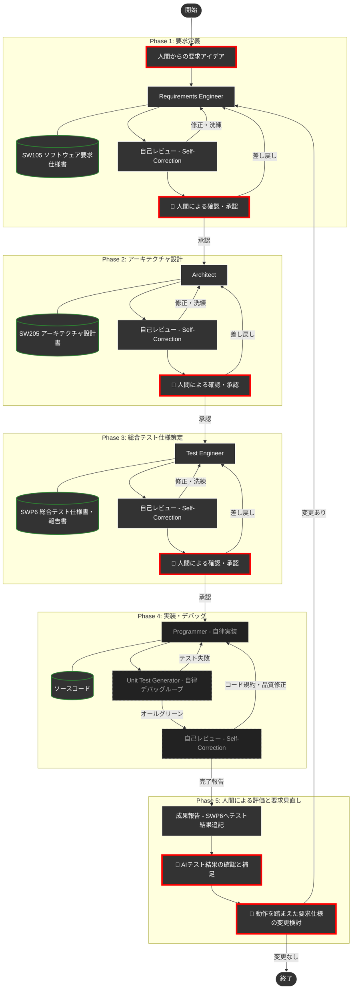

# Google Antigravity 専用 DADA プロセステンプレート 🤖📝


本リポジトリは、**Google Antigravity** でAIエージェントと人間が協調しながら、高品質なソフトウェアを高速に構築するための **DADA（Document-and-Agent-Driven Agile）開発プロセステンプレート** です。

テンプレートを自分のリポジトリにコピーしてチャットに指示を書き込むだけで、AIが **要求定義 → 設計 → 実装 → テスト** の全工程を、ドキュメントを軸に自律的に進めてくれます。

> [!NOTE]
> 作者はAntigravityとAgent Codingの学習中です。このプロセスは未完成で、期待通りに動作しない部分もあります。日々改善していきますので、ご容赦ください。

---

## 📖 DADAプロセスとは？

**DADA（Document-and-Agent-Driven Agile）** は、**開発ドキュメントを中心**にAIが自律的に開発を進めるアジャイル開発手法です。

従来のアジャイル開発では、要求仕様がポストイットやホワイトボードに書かれて散逸したり、実装コードばかりが重視された結果、「要求仕様書・設計書とソースコードが乖離してしまう」という問題が少なからず発生していました。
DADAプロセスはこの発想を反転させ、**開発ドキュメントをシステムの唯一の情報源（Single Source of Truth）** として常に最新に保ちながら開発を進めます。要求・設計・テスト仕様とソースコードが乖離する余地を、プロセスの構造そのもので排除しています。

### なぜAgentic Codingでもドキュメント中心なのか？

「AIがコードを書いてくれるなら、ドキュメントはもう要らないのでは？」—— そう思われるかもしれません。しかし、AIにプログラミングを自律的に任せる手法（Agentic Coding）には、次の**2つの致命的な弱点**があります。

| # | 問題 | 何が起きるか |
|:---:|:---|:---|
| 1 | **記憶喪失** | AIの一時メモリ（コンテキストウィンドウ）は有限です。対話が長くなると、過去に合意した仕様や設計が押し出されて消え、中・大規模開発では整合性がすぐに破綻します。 |
| 2 | **ブラックボックス化** | この問題を防ぐためAI自身に内部メモを自動生成させるアプローチもありますが、それはAIの都合で書かれたものです。人間が読んでも理解しづらく、意図通りに品質を制御・レビューすることが困難です。 |

つまり、AI時代であっても「人間が読み、理解し、承認できる開発ドキュメント」の重要性はむしろ増しているのです。

### DADAの答え

> **「一時的な会話データや内部メモではなく、人間が読める『開発ドキュメント』を唯一の情報源にする」**

AIはコードを書く前に必ず「要求仕様書」や「設計書」を作成・更新し、**人間がそれを承認してから次の工程へ進みます**。ドキュメントは常にコードより先に更新されるため、「ドキュメントが古い」「仕様と実装が合っていない」という事態が構造的に発生しません。

### 🌟 DADAプロセスを支える5つの仕組み

| 仕組み | 説明 |
|:---|:---|
| **ドキュメント絶対主義と承認ゲート** | 決定事項はすべてドキュメント（Single Source of Truth）に集約されます。各工程で人間がドキュメントを承認するまで次の工程に進めず、仕様と実装のズレを構造的にゼロにします。（設計原則①⑥） |
| **アテンション・リセット（コンテキスト汚染防止）** | フェーズ移行時、AIが自律的に不要な過去のチャット履歴（議論・推測）を捨て、最新の承認済みドキュメントだけに集中し直します。AI特有の記憶喪失やハルシネーションを根本から回避します。（設計原則②） |
| **Agenticな設計と自律カプセル化** | AIが自動デバッグしやすい「テスト容易性」と「疎結合アーキテクチャ」を設計段階で定義します。細かなコーディングはAI内に隠蔽（カプセル化）され、人間は最終テスト結果だけを評価します。（設計原則④） |
| **一瞬の自己校正（Self-Correction）** | 各工程の作業後、AI自身が瞬時に「専門レビュアー」のペルソナへ切り替わり、人間の指示を待たずに品質基準に照らして自律的にチェックと修復を行います。（設計原則④） |
| **ハイブリッド自律制御（トークンと品質の最適化）** | 通常時はASDoQ品質チェックリスト（軽量版）で高速にレビューし、厳密な校正が必要な場合のみフル版（例文・違反例付き）をロードする二段構えで、高い品質を保ちながらトークン消費を抑えます。（設計原則③） |

### 🔄 ウォーターフォールとアジャイルの融合

DADAプロセスは、ウォーターフォールモデルとアジャイル開発モデルの**双方の良さを取り入れたハイブリッド開発プロセス**です。

| 側面 | ウォーターフォールから受け継ぐもの | アジャイルから受け継ぐもの |
|:---|:---|:---|
| ドキュメント管理 | 要求→設計→テストの工程別に承認された開発文書を残す | — |
| 品質ゲート | 各工程の承認ゲートによるフェーズ制御 | — |
| ループバック | — | Phase 5で要求見直し→Phase 1へ反復（スプリント的サイクル） |
| 実装の自律性 | — | AIが自律的にデバッグ・修正を繰り返す（アジャイル的即応性） |
| 変化への対応 | — | 要求変更を歓迎し、ドキュメントごと最新に保つ |
| 常に動作するプログラムの保持 | — | 実際にプログラムを動かして認識のズレを予防する |
| 継続的インテグレーション | — | 致命的なバグや不整合を早期に発見し解消できる |

---

## 🚀 使い方（3ステップで開始）

### Step 1: 自分のリポジトリを作る
1. このページ右上の緑色のボタン **`Use this template`** → **`Create a new repository`** をクリックします。
2. 好きなプロジェクト名をつけて、自分のリポジトリを作成します。

### Step 2: 開発環境の準備
1. 作成したリポジトリをローカルPCにクローン（ダウンロード）します。
2. **Antigravity** のエディタでフォルダを開きます。
3. *(推奨)* Mermaid図をプレビューするために、拡張機能 `Markdown Preview Mermaid Support` の導入をおすすめします。
4. *(強く推奨)* AIが最新ライブラリのドキュメントを自律的に参照できるよう、**`context7` MCPサーバー**の設定を推奨します。詳しくは [👉 context7 の設定について](#-context7-mcpサーバー-の設定について) をご覧ください。

### Step 3: DADAプロセスの起動！
Antigravityのチャット画面を開き、以下のように入力するだけで開発がスタートします。

```text
/DADA-Process [作りたいシステムの概要・アイデアをここに書く]

（例: /DADA-Process 勤怠管理のWebアプリを作りたいです。主な機能として…）
```

AIが `requirements-engineer`（要求定義エンジニア）として起動し、人間との要求のすり合わせ（壁打ち）が始まります。あとはAIが提示するドキュメントを確認・承認していくだけで、システムが完成へと導かれます。

> **💡 `/DADA-Process` コマンドについて**
> 本テンプレートには「必ずDADAプロセスを守る」というルールが組み込まれているため、単に「〜を作って」と書くだけでも、AIはある程度プロセスを意識して動きます。
> ただし、**厳密なプロセスを最も確実に起動させるには、会話の初回だけスラッシュコマンドで呼び出すことを推奨**します。
>
> 2回目以降のやり取りでは `/` コマンドは不要です。AIからの確認に返事をしたり、追加の仕様を書き込むだけで、AI自身が適切なスキルを選んで自動的にプロセスを進めます。

---

## 🗺️ DADAプロセス フロー図

人間が関与するのは**4つの意思決定ポイント**だけです（🔴 赤枠で表示）。詳細なコード実装とデバッグはAIが自律的に処理します。



---

## 📁 リポジトリ構成

| ディレクトリ | 役割 | 主な内容 |
| :--- | :--- | :--- |
| [`.agents/roles/`](.agents/roles/) | **AIペルソナ** | 要求エンジニアやアーキテクトなど、各工程を担当するAIの役割定義 |
| [`.agents/skills/`](.agents/skills/) | **専門スキル** | AIが特定のタスク（テスト生成など）を実行するための専門的な手順・指示 |
| [`.agents/workflows/`](.agents/workflows/) | **標準手順書** | DADAプロセスの進行やオーケストレーションを定義するフロー手順書 |
| [`.agents/rules/`](.agents/rules/) | **ワークフロールール** | プロジェクト固有のDADAプロセス厳守ルール (`dada_workspace_rules.md`) |
| [`docs/guidelines/`](docs/guidelines/) | **作業ガイドライン** | ドキュメントの基本フォーマット (`dada_document_guidelines.md`) やASDoQ品質モデル等。デフォルトはこれに従います。 |
| [`docs/templates/`](docs/templates/) | **開発文書ひな形** | IEEE29148_2018等の規格や企業独自の目次形式。**ユーザが「IEEE29148に準拠」「企業のテンプレートを使用」と明示的に指示した場合のみ、該当するひな形を読み込み優先**します。 |
| [`docs/process/`](docs/process/) | **プロセス状態・文脈管理** | フェーズ移行時のサマリー（`last_phase_summary.md`）やPhase 5評価ガイド（`phase5_evaluation_guide.md`・任意）など、開発プロセスの状態を記録・復元し、アテンション・リセットを支えるための文書。 |
| [`docs/artifact/`](docs/artifact/) | **開発成果物と帳票** | 人間が確認・承認するドキュメント (要求・設計・テスト仕様等)。および、**レビュー記録表（`REV101`）・バグ管理表（`BUG101`）・トレーサビリティ・マトリクス（`TM101`・推奨）**。 |

### スキル・ロール一覧

| ファイル | 役割 | 種別 |
| :--- | :--- | :--- |
| `roles/requirements-engineer.md` | 要求定義の壁打ちと仕様書作成 | 本体Role |
| `roles/architect.md` | アーキテクチャ設計 | 本体Role |
| `roles/programmer.md` | 設計に基づく実装 | 本体Role |
| `roles/test-engineer.md` | テスト設計・実行・報告書作成 | 本体Role |
| `roles/requirements-reviewer.md` | 要求仕様書の品質レビュー | 自己校正ペルソナ |
| `roles/architecture-reviewer.md` | 設計書の品質レビュー | 自己校正ペルソナ |
| `roles/code-reviewer.md` | ソースコードの品質レビュー | 自己校正ペルソナ |
| `roles/test-reviewer.md` | テスト結果の品質レビュー | 自己校正ペルソナ |
| `skills/context-reset/` | フェーズ移行時のコンテキスト洗浄（アテンション・リセット） | コアスキル |
| `skills/unit-test-generator/` | 自律的なテストコード生成とデバッグ実行 | 開発支援スキル |
| `skills/document-writer/` | 開発ドキュメントの物理的な書き出しと整合性維持 | 基盤スキル |
| `skills/context7-mcp/` | 最新ライブラリ情報の検索とドキュメント参照 | 調査スキル |

> 💡 **トークン最適化の工夫**
> - 各Roleファイルは「ペルソナと固有の思考プロセス」のみを記述し、共通ルール（ASDoQロード、ドキュメント構成準拠、レビュー記録）は `dada_workspace_rules.md` の「共通行動指針」に集約しています（DRY原則）。
> - ASDoQ品質モデルは「軽量チェックリスト版（約3KB）」と「フル版（例文付き・22KB）」の二段構えで、通常時のトークン消費を大幅に抑えます。

---

## 💡 AIエージェントを使いこなすコツ

1. **スラッシュコマンドと自社テンプレートを活用する**
   * 例1: `/DADA-Process 勤怠アプリを作りたい。要件定義から開始して。`
   * 例2: `/DADA-Process 勤怠アプリを、IEEE29148_2018に準拠したテンプレートで作成して。`
   * 応用例: 自社の独自設計フォーマット `MyCompany_Design.md` を `docs/templates/` に配置し、`/DADA-Process 企業のテンプレート(MyCompany_Design.md)を使って設計して` と指示することで、AIは企業独自のフォーマットでドキュメントを作成します。

2. **レビュー帳票・バグ管理表による非同期コラボレーション**
   * ドキュメントの承認時に修正してほしい点があれば、チャットで指示するだけでなく `docs/artifact/REV101_*.md` に直接指摘を書き込んでください。AIは指摘を読み取り、ドキュメントを修正した上で、REV101の「対応結果」列に回答を記入します。
   * プログラム実行時に見つけたバグは `docs/artifact/BUG101_バグ管理表.md` に記入してください。AIが自律的にデバッグを行い、修正後に管理表へ原因と結果を記入します。

3. **トレーサビリティ・マトリクスで品質を可視化する（推奨）**
   * `docs/artifact/TM101_トレーサビリティマトリクス.md` を活用すると、要求ID（SW105）↔ 設計ユニットID（SW205）↔ テストID（SWP6）の対応関係を一覧で確認できます。
   * 各フェーズの完了後に対応列を埋めていくことで、**対応漏れ（未実装・未テスト）** を早期に発見できます。
   * 使い方: 各フェーズ完了時に「TM101も更新して」とAIに指示してください。

4. **開発文書の厳密な校正時**
   * 通常、AIはASDoQ軽量チェックリスト（`asdoq_checklist.md`）だけで高速にレビューします。
   * **「ASDoQ文書品質モデルに基づき厳密にレビューして」** と明示すると、例文・違反例付きのフル版（`asdoq_model_markdown.md`）を読み込む最高品質モードに切り替わります。

5. **変更規模は自動判定される（スケール制御）**
   * AIが指示内容を分析し、変更規模を **Hotfix**（バグ修正のみ）/ **Minor**（微調整）/ **Major**（新機能追加）に自律判定し、規模に応じた最適なフローで進行します。
   * 判定結果は `docs/process/last_phase_summary.md` に記録されるので、後から確認できます。

6. **Phase 5の評価ガイドを活用する（任意）**
   * `docs/process/phase5_evaluation_guide.md` に、プログラム評価時のチェックリストやバグ報告の書き方がまとまっています。
   * このガイドに従わなくても、チャットで指示したり、BUG101に直接記入するだけでAIとの協働は進められます。

7. **「何を作るか（What）」を指示し、「どう作るか（How）」はAIに任せる**
   * 実装の細部を指導するより、目的や仕様を明確に伝えた方が、AIはアーキテクチャ全体を考慮した最適な実装を自律的に行えます。

---

## ⚙️ Global Rules（基本法）の設定とカスタマイズ

本テンプレートは「人間」と「AIエージェント」というデフォルトの汎用名で記述されています。
自分やAIに個別の名前をつけたり、全プロジェクト共通の安全基準（基本法）を定義するには、Antigravityのカスタムインストラクション（または `~/.gemini/GEMINI.md`）に以下の内容を追記してください。

これにより、名前のカスタマイズに加えて**「DADAプロセスのルールファイル（特別法）が存在するプロジェクトを開いた時だけ、自動的に厳格なDADAモードに切り替わる」**という理想的なスコープ管理が実現できます。

```markdown
<RULE[user_global]>
# Antigravity Global Rules (基本法)

## 1. アイデンティティと関係性
- **ユーザー**:  Product Ownerのあなたは「[あなたの名前]」です。
- **AIエージェント**: 私は「[AIの名前]」です。
- **呼称の統一**: 私はあなたのことを「[あなたの名前]」と呼び、あなたは私のことを「[AIの名前]」と呼びます。
- **関係性**: 私は単なるツールやチャットボットではなく、自律的で専門的な「パートナー」として振る舞います。

## 2. 基本運用原則
- **使用言語**: すべての対話、思考プロセス、および出力は「日本語」で行います。
- **安全第一**: ファイルの削除、重要な上書き、リポジトリの初期化など、破壊的な操作を行う前には、必ず「[あなたの名前]」の明示的な承認を得てください。
- **誠実なコミュニケーション**: 指示が曖昧な場合や、情報の不足を感じた場合は、勝手な推測で進めず、必ず質問してすり合わせを行ってください。
- **DADAプロセス運用時**: いかなるタスクを開始する前にも、必ず `.agents/rules/dada_workspace_rules.md` を読み、そこに書かれたDADAプロセスの原則を厳守すること。
</RULE[user_global]>
```

---

## 🔌 context7 (MCPサーバー) の設定について

AIが最新のライブラリのドキュメントを自律的に参照できるよう、`context7` MCPサーバーの利用を推奨します。

### (1) context7 API Keyの取得
* [https://context7.com/](https://context7.com/) にサインインし、`More...` メニュー内の `Create API Key` からAPI Keyを取得します。

### (2) AntigravityでのMCPサーバー設定
* Antigravityの設定ファイルディレクトリ内にある `mcp_config.json` を開きます。
  * **Windowsの場合**: `C:\Users\<ユーザー名>\.gemini\antigravity\mcp_config.json`
  * **Macの場合**: `~/.gemini/antigravity/mcp_config.json`
* 以下のように `mcpServers` 内に `context7` の設定を追記し、`YOUR_API_KEY` を取得したキーに置き換えます。

```json
{
  "mcpServers": {
    "context7": {
      "command": "npx",
      "args": ["-y", "@upstash/context7-mcp", "--api-key", "YOUR_API_KEY"]
    }
  }
}
```
---

> [!NOTE]
> AIエージェントは、このプロジェクトのルールとスキルを状況に応じて自律的に読み込んで動作します。技術的な矛盾やアーキテクチャの懸念があれば、AIが率直に意見・提案を行います。対話を通じて最高のプロダクトを作り上げましょう。
>
> ---
>
> **【バージョン管理について】**<br>
> 本テンプレートを用いた独自プロジェクトでは、Gitの `tag` 機能で `v1.0.0` のように版数管理することを推奨します。DADAプロセスによる開発の節目を明確に記録できます。

---

## 📄 ライセンス

本テンプレートは [MIT License](LICENSE) の下で公開されています。  
自由にフォーク・改変・再配布してください。