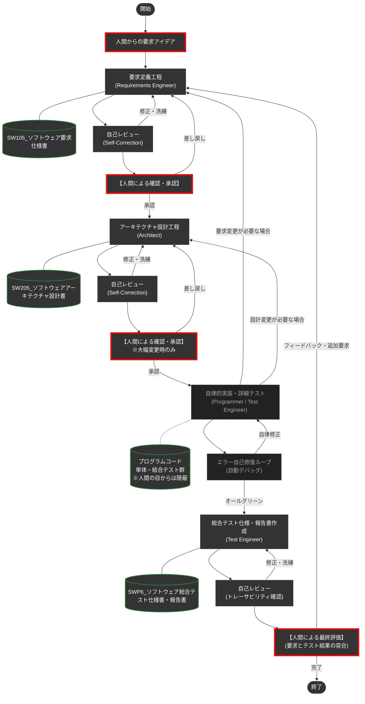

# Google Antigravity 専用 DADA プロセステンプレート 🤖📝

本リポジトリは、**Google Antigravity** 上でAIエージェントと人間が高度に協調し、高品質なソフトウェアを「ドキュメント駆動」で高速に構築するために最適化された専用の開発プロセステンプレートです。Antigravityの強力なスキル連携やワークフロー機能を最大限に引き出せるよう設計されています。

## 💥 従来のAgentic Codingの限界とDADAが提供する解決策

近年、AIにプログラミングを自律的に任せる手法が広まっていますが、実際の運用では致命的な2つの弱点がありました。

1. **記憶喪失（一時メモリの揮発性）**
   会話で決めた仕様や設計は、AIの「コンテキストウィンドウ（一時メモリ）」に置かれます。開発や対話が進むと古い記憶から押し出されて消滅し、整合性のとれた中・大規模なシステム開発がすぐに破綻します。
2. **ブラックボックス化（人間からの制御不能）**
   AIの記憶を繋ぎ止めるために内部で「手順書」等を自動生成させても、それはAI自身の都合で書かれたものであり、人間（Product Owner）が意図通りに制御したりレビューしたりすることができません。

**「コードではなく、ドキュメントを唯一の情報源（Single Source of Truth）にする」**
これが **DADAプロセス** の核となる解決策です。

### 🌟 DADAプロセスの圧倒的優位性

- **実装とテストの自律隠蔽カプセル化:** DADAプロセスでは、複雑なプログラミング（実装）や、細かい単体テスト・結合テストはAIエージェントの自律動作内に隠されています。人間は面倒なコードやエラーログと格闘する必要はなく、**「要求定義に適合した総合テスト（システムテスト）」** だけを確認・評価するだけで済みます。
- **Single Source of Truth (ドキュメント絶対主義):** AIはコードを書く前・直す前に、必ず「要求仕様書」や「設計書」を最新状態に更新します。仕様と実装の乖離（ドキュメントの陳腐化）が絶対に起きません。
- **高品質と低コストのハイブリッド自律制御:** 文書の新規作成や大幅改訂時には、IPA/SECのESPRやIEEE29148の要件定義の目次を参考にし、さらにASDoQのシステム開発文書品質モデルに則り、高品質な開発の実施と開発文書の作成を行います。一方で、軽微な修正の際には外部ガイドラインの再読み込みを自動スキップし、**API利用料（トークン）と処理の待ち時間を劇的に節約**します。
- **一瞬の自己校正（Self-Correction）:** 作業後、AI自身が瞬時に「専門レビュアー」へペルソナを切り替え、自ら品質をチェックして自己修復します。別エージェントを都度呼び出す無駄なコストと時間を削減しています。

---

## 🚀 使い方（GitHubテンプレートからの始め方）

このリポジトリは**Google Antigravity用のテンプレート**としてGitHub上に構築されています。以下の手順ですぐに自分のプロジェクトとしてDADAプロセスによるAI開発環境を開始できます。

### Step 1: 自分のリポジトリを作る
1. このページ右上にある緑色のボタン **`Use this template`** をクリックします。
2. **`Create a new repository`** を選び、好きなプロジェクト名をつけて自分のリポジトリを作成します。

### Step 2: 開発環境の準備
1. 作成したリポジトリをローカルPCにクローン（ダウンロード）します。
2. **Antigravity** のエディタでフォルダを開きます。
3. *(推奨)* Mermaid図をきれいにプレビューするために、Antigravity拡張の `Markdown Preview Mermaid Support` の導入をおすすめします。

### Step 3: DADAプロセスの起動！
AntigravityでAIエージェントのチャット画面を開き、以下のコマンドを入力して開発をスタートしてください。（Antigravityのワークフロー呼び出し機能を利用します）

```text
/DADA-Process [作りたいシステムの概要・アイデアをここに書く]
```
AIが `requirements-engineer` （要求定義エンジニア）として起動し、あなたとの要求のすり合わせ（壁打ち）が始まります。あとはAIが提示するドキュメントを確認・承認していくだけで、システムが完成へと導かれます。

---

## 🗺️ DADA プロセス フロー図

人間は「要求の合意」「アーキテクチャの大枠承認」「総合テストの評価」という**上位の意思決定**にのみフォーカスします。詳細なコード実装と単体・結合テストによるデバッグループは、AIエージェントの内部で自律的かつ自動的に処理されます。



---

## 📁 リポジトリ構成（エコシステム）

各ディレクトリには、AIが迷いなく自律的に動作するための「知識」と「ルール」が最適に配置されています。

| ディレクトリ | 役割 | 主要な内容 |
| :--- | :--- | :--- |
| [`.agents/`](.agents/) | **エージェントの脳** | 工程別の専門スキル (`skills/`) と標準手順書 (`workflows/DADA-Process.md`) |
| [`docs/`](docs/) | **ナレッジ・ベース** | 開発ドキュメントのテンプレート、ASDoQ品質モデル、作業ガイドライン |
| [`doc/`](doc/) | **開発成果物** | 人間が確認するドキュメント (SW105要求仕様書、SW205設計書、SWP6テスト報告書) |
| [`.cursor/`](.cursor/) | **全体制御** | Antigravityエージェントが常に守るべき絶対ルール (`project-rules.mdc` 等) |

---

## ⚙️ カスタマイズ：名称と役割の設定

本テンプレートでは、文脈の理解を助けるため便宜上、人間に **「マサ（Product Owner）」**、AIエージェントに **「ハル（Technical Partner）」** という名称を付与しています。

他プロジェクトや組織で本テンプレートを使用する際は、以下の対応を推奨します。

-   **名称の変更**: 
    以下のファイルに記述されている「マサ」「ハル」を、実際のプロジェクトメンバー名や任意の名称・愛称に置換してください。
    - [`.cursor/rules/project-rules.mdc`](.cursor/rules/project-rules.mdc) (Antigravityが読み込む全体ルールファイル)
    - [`.agents/skills/`](.agents/skills/) 配下の各 `SKILL.md`
    - [`docs/process/dada_document_guidelines.md`](docs/process/dada_document_guidelines.md)
    - **※ 固有名詞を排除**し、「マサ」を「Product Owner / 人間」に、「ハル」を「AI / Agent」に置き換えることで、より汎用的な運用も可能です。

---

> [!NOTE]
> あなたのパートナーであるAIエージェントは、このプロジェクトのルールとスキルを状況に応じて自律的に読み込んで動作します。技術的な矛盾やアーキテクチャの懸念があれば、AIが率直に意見・提案を行いますので、対話を通じて最高のプロダクトを作り上げましょう。