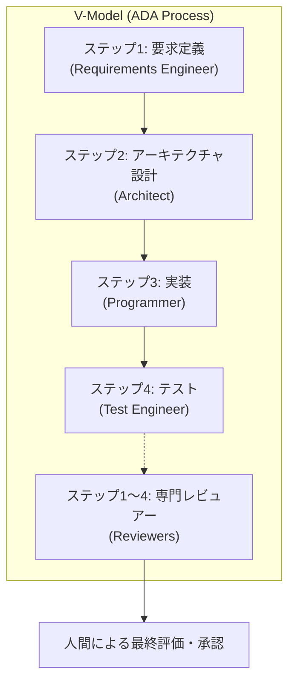

# Antigravity 開発用ワークスペーステンプレート (Agentic V-Model)

本リポジトリは、AIエージェント（Antigravity等）と人間（Masa）が高度に協調し、高品質なソフトウェアを高速に構築するための **「Agentic V字モデル」標準開発テンプレート** です。

---

## 1. コンセプト：ADA (Agent-Driven Agile) プロセス
本プロジェクトの核心は、AIが単なるコード生成器ではなく、各工程の「専門家」として振る舞う **ADAプロセス** です。

- **コード先行の絶対禁止**: まず「要求」と「設計」をドキュメントで合意し、その後にコードを実装します。
- **自律的品質担保**: 各工程で専門レビュアー（Reviewers）が ASDoQ 文書品質モデルに基づき厳格に審査します。

---

## 2. リポジトリ構成（エコシステム）
各ディレクトリには、AIが迷いなく自律的に動作するための「知識」と「ツール」が配置されています。

| ディレクトリ | 役割 | 主要な内容 |
| :--- | :--- | :--- |
| [`.agents/`](.agents/) | **エージェントの脳** | 工程別の専門スキル (`skills/`) と標準手順書 (`workflows/`) |
| [`docs/`](docs/) | **ナレッジ・ベース** | ドキュメント作成ガイドライン、ASDoQ品質モデル、開発ガイド |
| [`doc/`](doc/) | **開発成果物** | 要求仕様書(SW105)、設計書(SW205)、テスト報告書(SWP6) 等 |
| [`.cursor/`](.cursor/) | **エディタ制御** | エージェントが常に守るべき共通ルール (`project-rules.mdc`) |

---

## 3. クイックスタート：開発の始め方
新機能の追加や修正を行う際は、以下の流れでコマンドを起動してください。

1. **ワークフローの起動**: 
   チャット欄で `/ADA-Process` を入力・実行します。
2. **要求の提示**: 
   `requirements-engineer` と対話し、要求仕様書をドラフトします。
3. **自律的進行**: 
   AIが各ステップのスキルを読み込み、設計・実装・テストを順次進めます。
4. **評価と承認**: 
   最終的な「ソフトウェア総合テスト報告書」を確認し、開発完了を承認します。

---

## 4. 高度な運用シナリオ
### トークン最適化と規格準拠のハイブリッド
AIエージェントは通常、軽量な [ドキュメント構成ガイドライン](docs/process/ada_document_guidelines.md) に基づきスピーディーに動作します。ただし、「根本的なレビューをお願いします」という指示があった場合に限り、`docs/process/` 内の重厚なPDF規格資料（ESPR, IEEE等）を読み込み、極めて厳格な品質基準に立ち戻って作業を再構築します。

### 既存資産の移行
既存の仕様書やコードがある場合は、`doc/` および `src/` フォルダへ配置し、エージェントに「既存資産を理解して差分開発を開始して」と指示してください。

---

## 5. 開発環境とツール
- **Mermaid図の表示**: VS CodeやCursorで図表を美しく表示するために [Markdown Preview Mermaid Support](https://marketplace.visualstudio.com/items?itemName=shd101wyy.markdown-preview-enhanced) の導入を推奨します。
- **相対パスの徹底**: 本テンプレート内の全ての参照は相対パス化されており、どのディレクトリに配置しても、フォルダ名を変更しても、即座に動作可能です。

---

> [!NOTE]
> あなたのパートナーである「ハル」は、このプロジェクトのルールとスキルを常に読み込んでいます。技術的な矛盾があれば率直に提案しますので、対話を通じて最高のプロダクトを作り上げましょう。
